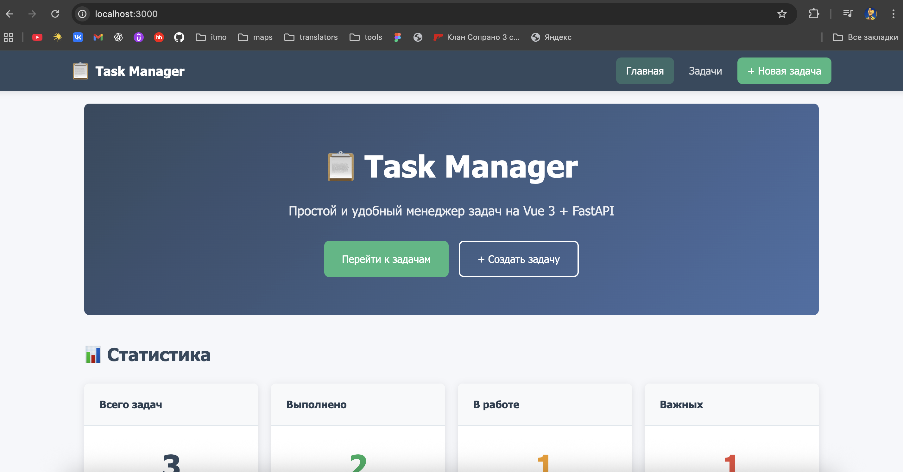
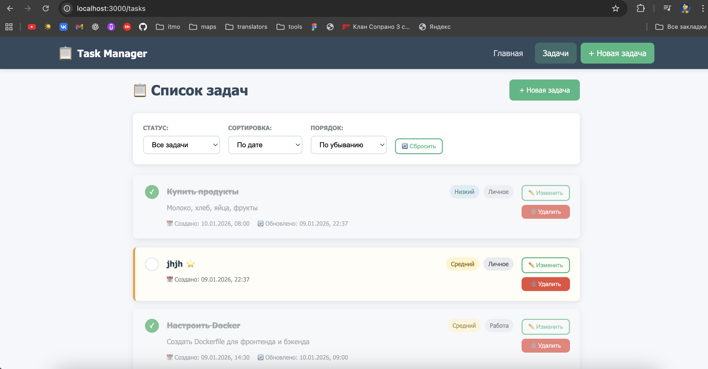
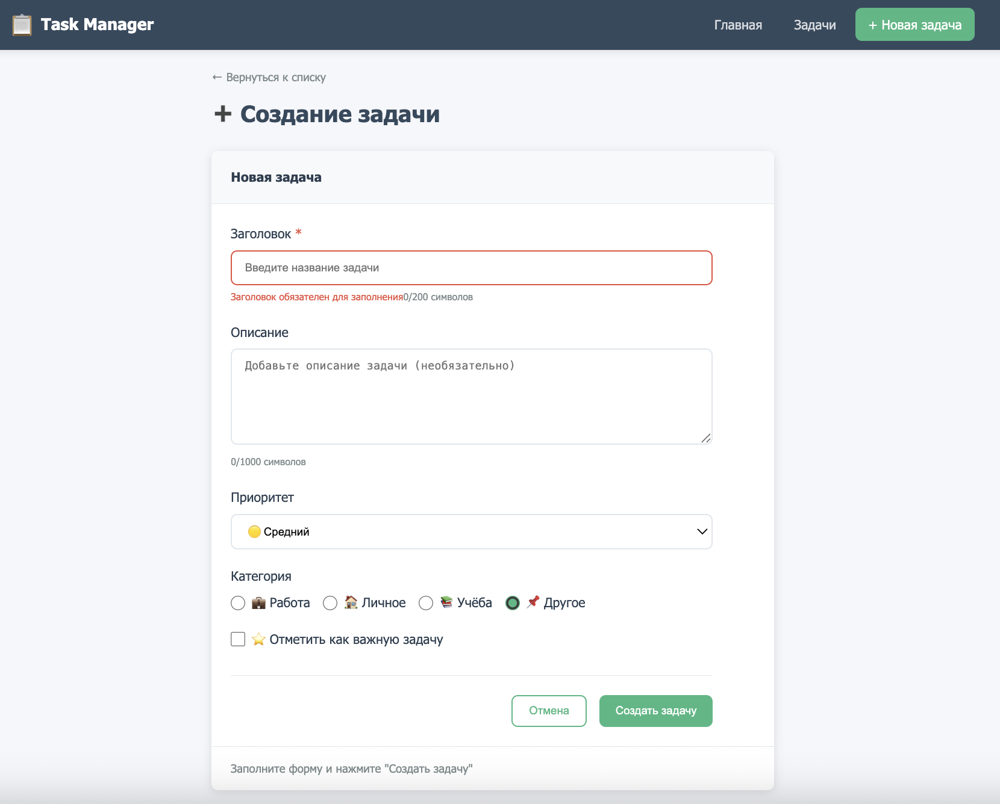
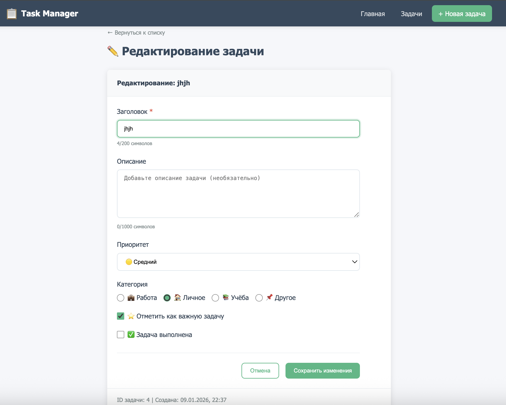

# Отчёт по лабораторной работе

## 1. Титульная часть

- **Автор:** Маматходжаев Рафаэль
- **Группа:** P 3468
- **Дата:** 10.01.2026
- **Название работы:** Разработка SPA-приложения на Vue 3 с сервером на Python (Task Manager)

---

## 2. Цель работы

Освоить базовые возможности Vue 3 (работа с данными и событиями, computed/watch, формы, компоненты и слоты, маршрутизация), а также реализовать взаимодействие с сервером по REST API и запуск проекта в Docker.

---

## 3. Реализованный функционал

### 3.1. Клиентская часть (Vue 3)

**Страницы (Vue Router):**
- `/` — главная страница (Dashboard/приветственный экран)
- `/tasks` — список задач
- `/tasks/new` — создание задачи
- `/tasks/:id/edit` — редактирование задачи
- `/*` — страница 404

**Компоненты:**
- `AppHeader.vue` — верхнее меню и навигация
- `AppFooter.vue` — нижняя панель
- `TaskList.vue` — список задач (`v-for`, `v-if` для пустого состояния)
- `TaskItem.vue` — карточка одной задачи (props + события в родителя)
- `TaskForm.vue` — форма создания/редактирования (валидация, `v-model`)
- `LayoutCard.vue` — компонент-контейнер со слотами

**Фильтрация/сортировка:**
- На странице списка задач реализована фильтрация по статусу (все/выполненные/невыполненные)
- Реализована сортировка по дате, алфавиту и приоритету

**Computed / Watch:**
- `computed` используется для:
  - вычисления отфильтрованного и отсортированного списка задач
  - формирования сообщения пустого состояния
- `watch` используется для:
  - отслеживания изменения фильтров (можно расширить до запроса на сервер)
  - заполнения формы при получении `initialData` в режиме редактирования

**Слоты:**
Компонент `LayoutCard.vue` демонстрирует:
- обычный слот (default)
- именованные слоты (`header`, `footer`)
- слот с ограниченной областью видимости (scoped slot) — `actions` (передаёт методы и состояние в шаблон родителя)

**Маршрутизация (Vue Router):**
- именованные маршруты (`home`, `tasks`, `task-create`, `task-edit`, `not-found`)
- параметры маршрута (`:id`)
- программная навигация (`router.push`) при редактировании/создании
- страница 404
- navigation guard для установки `document.title`

---

### 3.2. Серверная часть (FastAPI)

**CRUD эндпоинты:**
- `GET /api/tasks` — список задач (возможна фильтрация/сортировка через query params)
- `GET /api/tasks/{id}` — получение задачи по ID
- `POST /api/tasks` — создание задачи
- `PUT /api/tasks/{id}` — обновление задачи
- `PATCH /api/tasks/{id}/toggle` — переключение статуса выполнения
- `DELETE /api/tasks/{id}` — удаление задачи
- `GET /api/stats` — статистика для главной страницы

**Хранение данных:**
- данные сохраняются в `backend/tasks.json`
- после операций создания/обновления/удаления изменения записываются в файл

---

## 4. Скриншоты интерфейса

Скриншоты сохранить в папку `docs/screenshots/` и вставить сюда.

- **Главная**

  

- **Список задач**

  

- **Форма создания**

  

- **Форма редактирования**

  

---

## 5. Пример кода (краткие фрагменты)

### 5.1. Вывод списка задач (v-for) + события от дочернего компонента

```vue
<TaskItem
  v-for="task in tasks"
  :key="task.id"
  :task="task"
  @edit="$emit('edit', $event)"
  @delete="$emit('delete', $event)"
  @toggle-status="$emit('toggle-status', $event)"
/>
```

### 5.2. Computed: фильтрация и сортировка на клиенте

```js
const filteredTasks = computed(() => {
  let result = [...tasks.value]

  if (filters.status === 'completed') result = result.filter(t => t.is_completed)
  if (filters.status === 'pending') result = result.filter(t => !t.is_completed)

  result.sort((a, b) => {
    if (filters.sortBy === 'title') return a.title.localeCompare(b.title, 'ru')
    if (filters.sortBy === 'date') return new Date(a.created_at) - new Date(b.created_at)
    return 0
  })

  return filters.sortOrder === 'desc' ? result.reverse() : result
})
```

### 5.3. Пример FastAPI-эндпоинта (создание задачи)

```py
@app.post("/api/tasks", response_model=Task, status_code=201)
async def create_task(task_data: TaskCreate):
    tasks = load_tasks()
    now = datetime.now().isoformat()
    new_task = {
        "id": get_next_id(tasks),
        "title": task_data.title,
        "description": task_data.description,
        "priority": task_data.priority.value,
        "category": task_data.category.value,
        "is_important": task_data.is_important,
        "is_completed": task_data.is_completed,
        "created_at": now,
        "updated_at": now
    }
    tasks.append(new_task)
    save_tasks(tasks)
    return new_task
```

---

## 6. JSON данные (пример)

Файл данных: `backend/tasks.json`.

Пример структуры:

```json
[
  {
    "id": 2,
    "title": "Настроить Docker",
    "description": "Создать Dockerfile для фронтенда и бэкенда",
    "priority": "medium",
    "category": "work",
    "is_important": false,
    "is_completed": true,
    "created_at": "2026-01-09T14:30:00",
    "updated_at": "2026-01-10T09:00:00"
  }
]
```

---

## 7. Инструкция по запуску (Docker)

Из корня проекта:

```bash
# Сборка
docker compose build

# Запуск
docker compose up
```

Если используется старая команда:

```bash
docker-compose up --build
```

После запуска:
- Frontend: http://localhost:3000
- Backend: http://localhost:8000
- Swagger (FastAPI): http://localhost:8000/docs

---

## 8. Выводы

В ходе работы было изучено:
- структура и синтаксис Vue 3 (Composition API)
- компонентный подход (props, события, слоты)
- маршрутизация Vue Router (именованные маршруты, параметры, 404, программная навигация)
- работа с формами и валидацией, `v-model` и модификаторы
- computed/watch и реактивность
- взаимодействие с REST API
- контейнеризация проекта в Docker и запуск через Docker Compose
- структурирование SPA-проекта и оформление отчёта
